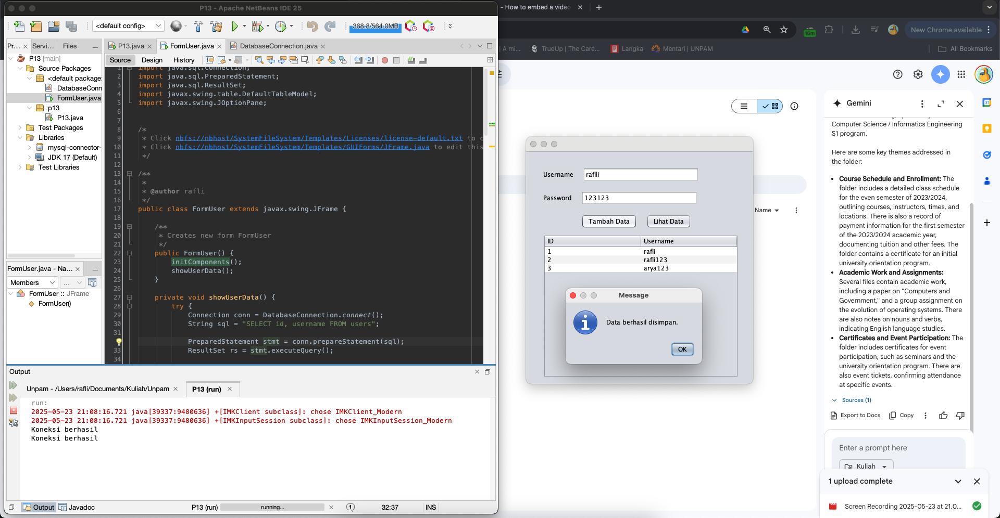

# Pertemuan 13 - Integrasi Java dengan Database MySQL

## 📸 Hasil Aplikasi


## 📋 Deskripsi
Program sederhana yang mengintegrasikan aplikasi Java dengan database MySQL untuk pengelolaan data pengguna. Aplikasi ini memungkinkan pengguna untuk menambahkan data melalui form dan menampilkan data yang tersimpan dalam database.

## 🎯 Tujuan Pembelajaran
- Memahami konsep koneksi database MySQL dengan Java
- Mengimplementasikan operasi CRUD (Create, Read) 
- Mengelola data pengguna melalui interface aplikasi Java
- Menggunakan MySQL Connector/J sebagai driver JDBC

## 🛠️ Teknologi yang Digunakan
- Java
- MySQL Database
- MySQL Connector/J
- Swing (untuk GUI)

## 📦 Struktur Database
**Database:** `p13_users`

**Tabel:** `users`
```sql
CREATE TABLE users (
    id INT AUTO_INCREMENT PRIMARY KEY,
    username VARCHAR(50) NOT NULL,
    password VARCHAR(100) NOT NULL
);
```

## 🚀 Cara Menjalankan
1. Pastikan MySQL Server sudah berjalan
2. Buat database `p13_users` dan tabel `users`
3. Tambahkan MySQL Connector/J ke dalam project
4. Jalankan aplikasi Java
5. Gunakan form untuk menambahkan data pengguna


## ✨ Fitur
- ✅ Form input data pengguna (username & password)
- ✅ Penyimpanan data ke database MySQL
- ✅ Tampilan data pengguna dalam tabel
- ✅ Koneksi database yang stabil

## 📚 Pembelajaran
Praktikum ini memberikan pemahaman tentang:
- Integrasi aplikasi Java dengan database
- Implementasi operasi database dasar
- Penanganan koneksi dan exception
- Sinkronisasi data antara aplikasi dan database

---
**Mata Kuliah:** Pemrograman 1  
**Dosen:** Niki Ratama, S.Kom., M.Kom  
**Mahasiswa:** Muhammad Rafli Aryansyah (231011401531)